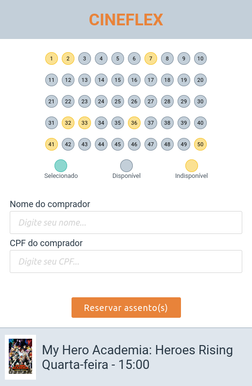

# Cineflex

    
    
    
    

    
    

> Sistema de compra de ingresso de cinema

## 🚀 Como usar o projeto

### 🛹 Clona o repositório

`git clone https://github.com/andreseichi/projeto9-cineflex.git`

or

`git@github.com:andreseichi/projeto9-cineflex.git`

### 📒 Acessa o repositório

`cd projeto9-cineflex`

### 🧭 Instale todas as dependências com npm

`npm install`

### 🔨 Faz a build

`npm build`
